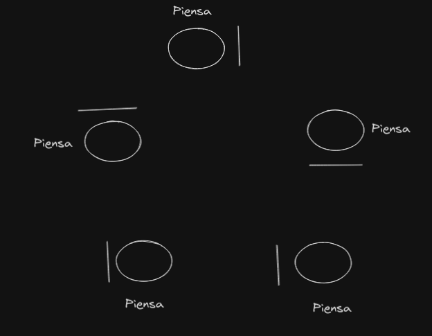
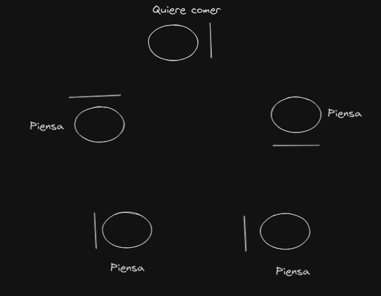
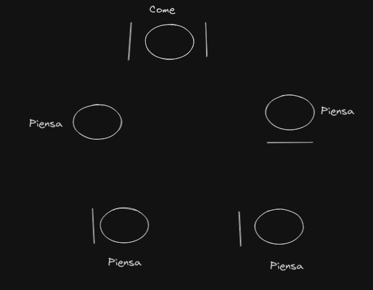
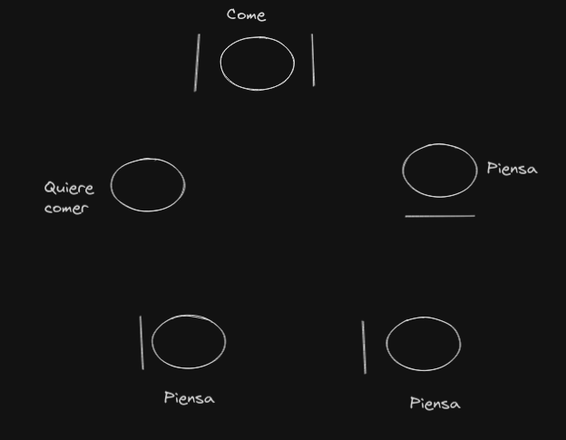
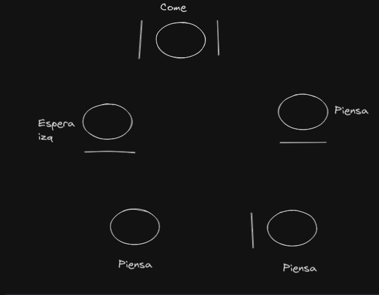
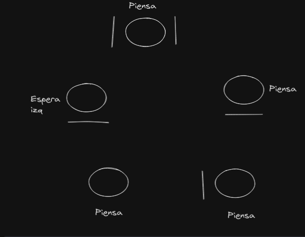
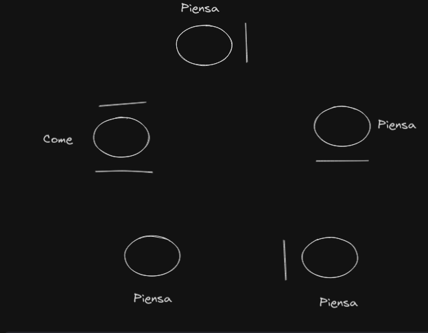
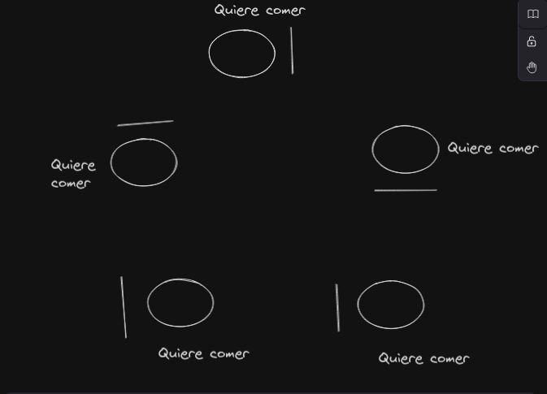
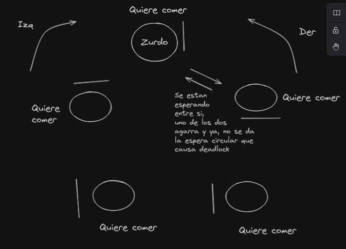

La solucion es que uno de los filosofos agarre de derecha a izquierda
y los demas agarren de derecha a izquierda.

Asi funca el problema:

El problema es que si se da lo siguiente, puede ocurrir un deadlock:

Para evitar esto, uno de los filosofos siempre agarra primero izquierda y despues derecha, y el resto agarran primero derecha y despues izquierda. Si el de arriba es el que agarra de izquierda a derecha, seria asi:

